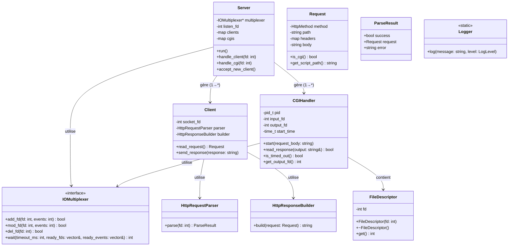
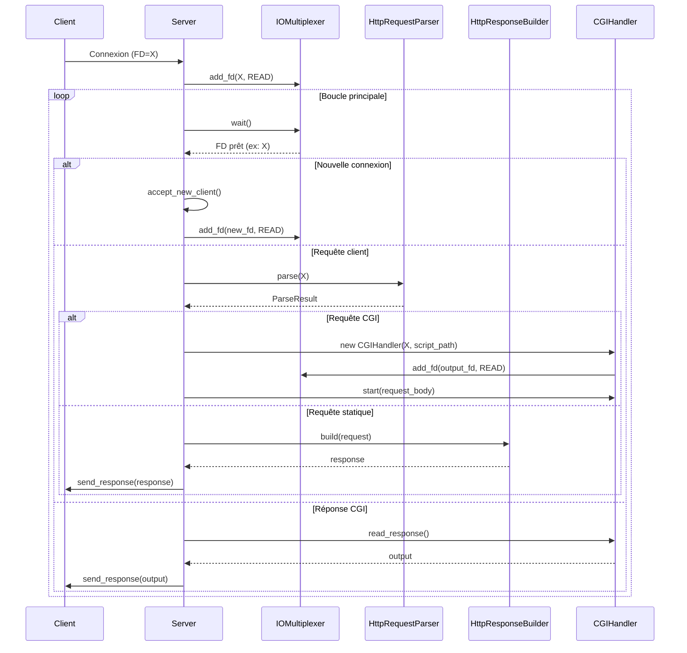

Here is a design example:

```mermaid
classDiagram
    %% Classes Core
    class IOMultiplexer {
        <<interface>>
        +add_fd(fd: int, events: int) bool
        +mod_fd(fd: int, events: int) bool
        +del_fd(fd: int) bool
        +wait(timeout_ms: int, ready_fds: vector<int>&, ready_events: vector<int>&) int
    }

    class Server {
        -IOMultiplexer* multiplexer
        -int listen_fd
        -map<int, Client*> clients
        -map<int, CGIHandler*> cgis
        +run()
        +handle_client(fd: int)
        +handle_cgi(fd: int)
        +accept_new_client()
    }

    class Client {
        -int socket_fd
        -HttpRequestParser parser
        -HttpResponseBuilder builder
        +read_request() Request
        +send_response(response: string)
    }

    class CGIHandler {
        -pid_t pid
        -int input_fd
        -int output_fd
        -time_t start_time
        +start(request_body: string)
        +read_response(output: string&) bool
        +is_timed_out() bool
        +get_output_fd() int
    }

    %% Classes HTTP
    class HttpRequestParser {
        +parse(fd: int) ParseResult
    }

    class HttpResponseBuilder {
        +build(request: Request) string
    }

    class Request {
        -HttpMethod method
        -string path
        -map<string, string> headers
        -string body
        +is_cgi() bool
        +get_script_path() string
    }

    class ParseResult {
        +bool success
        +Request request
        +string error
    }

    %% Classes Utilitaires
    class FileDescriptor {
        -int fd
        +FileDescriptor(fd: int)
        +~FileDescriptor()
        +get() int
    }

    class Logger {
        <<static>>
        +log(message: string, level: LogLevel)
    }

    %% Relations
    Server --> IOMultiplexer : utilise
    Server --> Client : gère (1→*)
    Server --> CGIHandler : gère (1→*)
    Client --> HttpRequestParser : utilise
    Client --> HttpResponseBuilder : utilise
    CGIHandler --> IOMultiplexer : utilise
    CGIHandler --> FileDescriptor : contient
```

Find below the event loop

```mermaid
sequenceDiagram
    participant C as Client
    participant S as Server
    participant M as IOMultiplexer
    participant P as HttpRequestParser
    participant B as HttpResponseBuilder
    participant G as CGIHandler

    C->>S: Connexion (FD=X)
    S->>M: add_fd(X, READ)
    loop Boucle principale
        S->>M: wait()
        M-->>S: FD prêt (ex: X)
        alt Nouvelle connexion
            S->>S: accept_new_client()
            S->>M: add_fd(new_fd, READ)
        else Requête client
            S->>P: parse(X)
            P-->>S: ParseResult
            alt Requête CGI
                S->>G: new CGIHandler(X, script_path)
                G->>M: add_fd(output_fd, READ)
                S->>G: start(request_body)
            else Requête statique
                S->>B: build(request)
                B-->>S: response
                S->>C: send_response(response)
            end
        else Réponse CGI
            S->>G: read_response()
            G-->>S: output
            S->>C: send_response(output)
        end
    end
```
